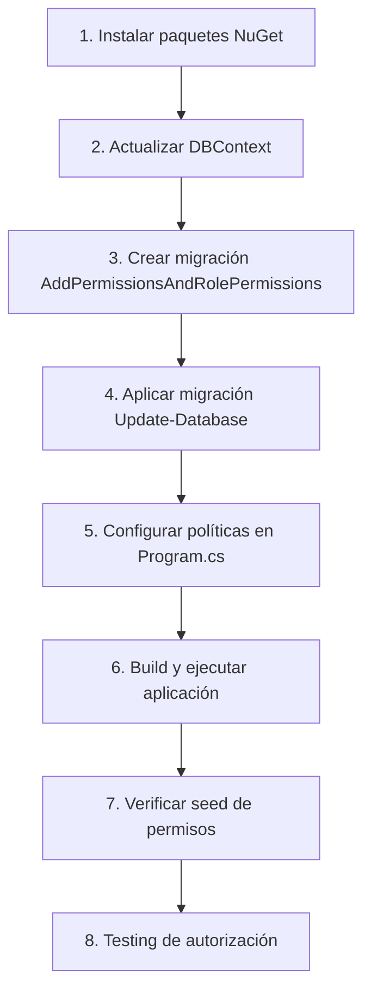

# ?? Resumen Ejecutivo - Fase 2 Completada

## ? Estado Actual

**Fase 1:** ? Completada (esperando migración)
**Fase 2:** ? Completada (esperando configuración Program.cs y paquetes NuGet)

---

## ?? Archivos Creados en Fase 2 (5)

1. ? `CC.Domain/Interfaces/Services/IAuthorizationService.cs`
2. ? `CC.Aplication/Services/AuthorizationService.cs` (corregido)
3. ? `CC.Infrastructure/Authorization/PermissionRequirement.cs`
4. ? `CC.Infrastructure/Authorization/PermissionHandler.cs`
5. ? `DependencyInyectionHandler.cs` actualizado

---

## ?? ACCIONES REQUERIDAS (3 pasos)

### 1. Instalar Paquetes NuGet en CC.Infrastructure
**Archivo:** `NUGET_PACKAGES_INFRASTRUCTURE.md`

```bash
Install-Package Microsoft.AspNetCore.Authorization -ProjectName CC.Infrastructure
Install-Package Microsoft.AspNetCore.Http.Abstractions -ProjectName CC.Infrastructure
```

### 2. Actualizar DBContext.cs (Fase 1 pendiente)
**Archivo:** `MANUAL_DBCONTEXT_UPDATE_INSTRUCTIONS.md`
- Agregar DbSets: `Permissions`, `RolePermissions`
- Agregar configuración en `OnModelCreating`

### 3. Configurar Políticas en Program.cs
**Archivo:** `PROGRAM_CS_AUTHORIZATION_CONFIG.md`
- Agregar después de configuración JWT
- 27 políticas de autorización
- Registro de `PermissionHandler`

---

## ?? Orden de Implementación Recomendado



---

## ?? Comandos en Secuencia

```bash
# 1. Paquetes NuGet
Install-Package Microsoft.AspNetCore.Authorization -ProjectName CC.Infrastructure
Install-Package Microsoft.AspNetCore.Http.Abstractions -ProjectName CC.Infrastructure

# 2. Actualizar DBContext (manual)
# Ver: MANUAL_DBCONTEXT_UPDATE_INSTRUCTIONS.md

# 3. Migración
Add-Migration AddPermissionsAndRolePermissions -Context DBContext
Update-Database -Context DBContext

# 4. Configurar Program.cs (manual)
# Ver: PROGRAM_CS_AUTHORIZATION_CONFIG.md

# 5. Build
dotnet build

# 6. Ejecutar
dotnet run --project .\Api-Portar-Paciente\Api-Portar-Paciente.csproj
```

---

## ?? Testing Después de Completar Fase 2

### 1. Verificar Seed de Permisos
```sql
SELECT Module, COUNT(*) as Quantity 
FROM Permissions 
WHERE IsActive = 1 
GROUP BY Module;

-- Resultado esperado:
-- Requests: 6
-- Users: 5
-- Roles: 5
-- Reports: 3
-- NilRead: 3
-- Configuration: 3
```

### 2. Verificar Logs al Iniciar
```
? Migraciones aplicadas e inicialización de datos completada
Autenticación JWT configurada correctamente
Políticas de autorización configuradas: PatientOnly, AdminOnly y permisos granulares
```

### 3. Testing de Endpoint Protegido
```csharp
// Crear controller de prueba
[ApiController]
[Route("api/test")]
public class TestAuthController : ControllerBase
{
    [HttpGet("public")]
    public IActionResult Public() => Ok("Acceso público");
    
    [Authorize(Policy = "AdminOnly")]
    [HttpGet("admin")]
    public IActionResult Admin() => Ok("Solo admin");
    
    [Authorize(Policy = "CanViewRequests")]
    [HttpGet("requests")]
    public IActionResult Requests() => Ok("Requiere Requests.View");
}
```

**Testing:**
- Sin token ? 401 Unauthorized
- Token de paciente ? 403 Forbidden en `/admin` y `/requests`
- Token de admin sin permiso ? 403 Forbidden en `/requests`
- Token de admin con permiso ? 200 OK en `/requests`

---

## ?? Arquitectura Completa

```
???????????????????????????????????????????????????????????????
?                        Frontend                              ?
?  (Envía JWT en header: Authorization: Bearer <token>)       ?
???????????????????????????????????????????????????????????????
                            ?
                            ?
???????????????????????????????????????????????????????????????
?                   ASP.NET Core Pipeline                      ?
?                                                              ?
?  1. Authentication Middleware                                ?
?     ??> Valida JWT, establece User.Claims                   ?
?                                                              ?
?  2. Authorization Middleware                                 ?
?     ??> Verifica [Authorize] attributes                     ?
?         ??> Llama a PermissionHandler                       ?
?                                                              ?
?  3. PermissionHandler                                        ?
?     ??> Verifica UserType != "Patient" (si policy admin)    ?
?     ??> Llama a IAuthorizationService                       ?
?                                                              ?
?  4. AuthorizationService                                     ?
?     ??> Busca en Cache (10 min TTL)                         ?
?     ??> Si no: Consulta BD (UserManager ? RoleManager)      ?
?     ??> Obtiene permisos de roles via RolePermissionRepo    ?
?     ??> Guarda en cache y retorna                           ?
?                                                              ?
?  5. Controller                                               ?
?     ??> Acceso permitido/denegado                           ?
???????????????????????????????????????????????????????????????
                            ?
                            ?
???????????????????????????????????????????????????????????????
?                      Base de Datos                           ?
?                                                              ?
?  ???????????????    ????????????????????    ?????????????? ?
?  ? AspNetUsers ?????? AspNetUserRoles  ?????? AspNetRoles? ?
?  ???????????????    ????????????????????    ?????????????? ?
?                                                 ?            ?
?                                                 ?            ?
?                     ?????????????????????????????            ?
?                     ?                                        ?
?              ????????????????         ???????????????       ?
?              ?RolePermissions??????????? Permissions ?       ?
?              ????????????????         ???????????????       ?
???????????????????????????????????????????????????????????????
```

---

## ?? Próxima Fase (Fase 3)

Una vez completadas las configuraciones manuales, continuar con:

### Fase 3: Controllers de Administración
- [ ] `RolesController` - CRUD de roles
- [ ] `PermissionsController` - Listar permisos disponibles
- [ ] Endpoint: Asignar permisos a rol
- [ ] Endpoint: Obtener permisos de rol
- [ ] Endpoint: Asignar rol a usuario

---

## ?? Archivos de Referencia Creados

1. **FASE1_RESUMEN_E_INSTRUCCIONES.md** - Fase 1 completa
2. **MANUAL_DBCONTEXT_UPDATE_INSTRUCTIONS.md** - DBContext
3. **DBCONTEXT_PERMISSIONS_UPDATE.txt** - Código DBContext
4. **SEEDDB_PERMISSIONS_METHODS.txt** - Seed de permisos (aplicado)
5. **FASE2_RESUMEN_SERVICIO_AUTORIZACION.md** - Fase 2 completa
6. **PROGRAM_CS_AUTHORIZATION_CONFIG.md** - Políticas Program.cs
7. **NUGET_PACKAGES_INFRASTRUCTURE.md** - Paquetes NuGet
8. **FASE2_RESUMEN_EJECUTIVO.md** - Este archivo

---

## ? Checklist General

### Fase 1: Estructura Base
- [x] Entidades Permission y RolePermission
- [x] Repositorios e interfaces
- [x] DTOs
- [x] Seed de 27 permisos
- [x] Registros en DI
- [ ] **DBContext actualizado** ?? **PENDIENTE**
- [ ] Migración creada y aplicada

### Fase 2: Servicio de Autorización
- [x] IAuthorizationService
- [x] AuthorizationService con cache
- [x] PermissionRequirement
- [x] PermissionHandler
- [x] Registro en DI
- [ ] **Paquetes NuGet instalados** ?? **PENDIENTE**
- [ ] **Políticas en Program.cs** ?? **PENDIENTE**

### Fase 3: Controllers Admin (Próxima)
- [ ] RolesController
- [ ] PermissionsController
- [ ] Endpoints de gestión

### Fase 4: Actualizar Controllers Existentes
- [ ] RequestController con policies
- [ ] NilReadController (decidir si requiere policies)

---

## ?? Conceptos Clave Implementados

? **Authorization basada en Claims** (UserType, Role)
? **Authorization basada en Permisos** (granular)
? **Custom Authorization Handler** (PermissionHandler)
? **Cache de permisos** (performance)
? **Invalidación de cache** (consistencia)
? **Políticas reutilizables** (27 policies)
? **Logging completo** (auditoría)
? **Separation of Concerns** (Handler ? Service ? Repository)

---

**?? Objetivo Final:** Sistema de roles y permisos completamente funcional donde:
- Pacientes solo acceden a sus datos (UserType = "Patient")
- Usuarios admin tienen permisos granulares configurables
- Roles se gestionan desde frontend
- Permisos se asignan a roles (no a usuarios directamente)
- Sistema escalable y performante

---

**Estado:** ? Código completo hasta Fase 2, esperando 3 pasos manuales para ejecutar.
