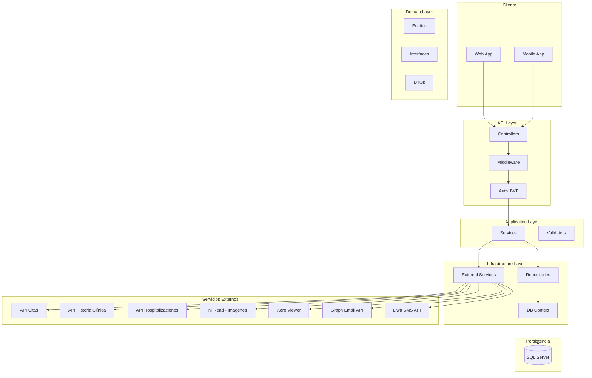
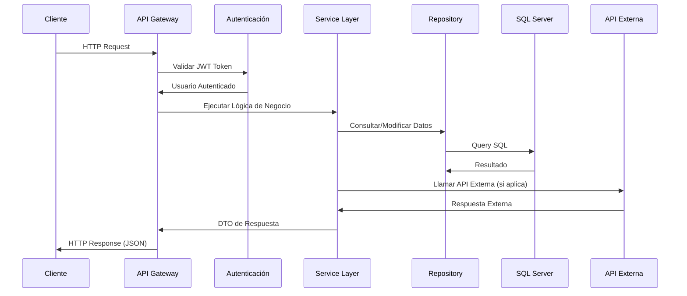
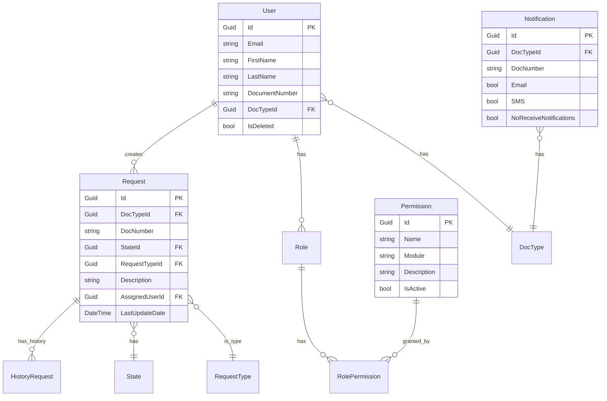
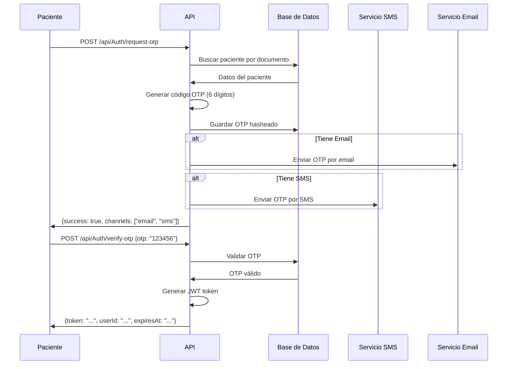

# ?? Portal Pacientes API - Fundación Cardioinfantil

API REST backend para el Portal de Pacientes de la Fundación Cardioinfantil - LaCardio, diseñada para proporcionar servicios digitales a pacientes y gestión administrativa del portal.

---

## ?? Descripción General del Proyecto

### Propósito
El **Portal Pacientes API** es una plataforma backend que centraliza la gestión de servicios digitales para pacientes de la Fundación Cardioinfantil, incluyendo:

- Autenticación y autorización de pacientes y usuarios administrativos
- Gestión de solicitudes y PQRS
- Integración con servicios médicos externos (citas, historia clínica, hospitalizaciones, imágenes diagnósticas)
- Administración de contenido (FAQs, CardioTV, encuestas)
- Telemetría y reportes
- Notificaciones por email y SMS

### Problema que Resuelve
- **Pacientes**: Acceso digital a información médica, gestión de citas, solicitudes y consultas desde un único portal
- **Administradores**: Gestión centralizada de usuarios, contenido, solicitudes y seguimiento de actividad
- **Personal médico**: Acceso controlado a información de pacientes y gestión de solicitudes

### Público Objetivo
- **Pacientes** de la Fundación Cardioinfantil
- **Personal administrativo** del hospital
- **Equipo de soporte** técnico y médico

### Resumen Funcional
API REST construida con **.NET 8** siguiendo arquitectura **Clean Architecture** con capas de Domain, Application, Infrastructure y Presentation. Implementa autenticación JWT, autorización basada en permisos granulares, integración con múltiples APIs externas y sistema completo de auditoría y telemetría.

---

## ??? Arquitectura del Backend

### Arquitectura General
El proyecto sigue los principios de **Clean Architecture** con separación en capas:

```
???????????????????????????????????????????????????????????????
?                    API Layer (Presentation)                 ?
?           Controllers + Middleware + Handlers               ?
???????????????????????????????????????????????????????????????
                   ?
???????????????????????????????????????????????????????????????
?              Application Layer (CC.Aplication)              ?
?                  Services + Business Logic                  ?
???????????????????????????????????????????????????????????????
                   ?
???????????????????????????????????????????????????????????????
?               Domain Layer (CC.Domain)                      ?
?      Entities + DTOs + Interfaces + Constants               ?
???????????????????????????????????????????????????????????????
                   ?
???????????????????????????????????????????????????????????????
?          Infrastructure Layer (CC.Infrastructure)           ?
?    Repositories + DB Context + External Services            ?
???????????????????????????????????????????????????????????????
```

### Diagrama de Arquitectura



### Flujo de Petición-Respuesta



### Módulos Principales

| Módulo | Descripción | Endpoints |
|--------|-------------|-----------|
| **Autenticación** | Login pacientes/admin, OTP, recuperación contraseña | `/api/Auth/*` |
| **Solicitudes** | Gestión de PQRS y solicitudes de pacientes | `/api/Request/*` |
| **Usuarios** | Administración de usuarios y roles | `/api/Admin/Users/*` |
| **Permisos** | Control de acceso granular | `/api/Admin/Permissions/*` |
| **Citas** | Consulta de citas médicas | `/api/Appointments/*` |
| **Historia Clínica** | Acceso a episodios médicos y PDFs | `/api/ClinicalHistory/*` |
| **Hospitalizaciones** | Consulta de hospitalizaciones | `/api/Hospitalizations/*` |
| **Imágenes Diagnósticas** | Acceso a exámenes y reportes (NilRead/Xero) | `/api/NilRead/*`, `/api/Xero/*` |
| **Contenido** | FAQs, CardioTV, encuestas | `/api/FrecuentQuestions/*`, `/api/CardioTV/*` |
| **Notificaciones** | Preferencias de notificación | `/api/Notification/*` |
| **Telemetría** | Logs de actividad y métricas | `/api/Telemetry/*` |
| **Reportes** | Generación de reportes administrativos | `/api/Reports/*` |

---

## ?? Estructura del Proyecto

```
PortalPacientes/
?
??? Api-Portar-Paciente/              # ?? Capa de Presentación (API REST)
?   ??? Controllers/                  # Controladores REST
?   ?   ??? AuthController.cs        # Autenticación JWT + OTP
?   ?   ??? RequestController.cs     # Gestión de solicitudes
?   ?   ??? Admin/                   # Controladores administrativos
?   ?   ?   ??? UsersController.cs
?   ?   ?   ??? RolesController.cs
?   ?   ?   ??? PermissionsController.cs
?   ?   ??? AppointmentsController.cs
?   ?   ??? ClinicalHistoryController.cs
?   ?   ??? HospitalizationsController.cs
?   ?   ??? NilReadController.cs
?   ?   ??? XeroController.cs
?   ??? Handlers/                    # Middleware y manejo de errores
?   ?   ??? ErrorHandlingMiddleware.cs
?   ?   ??? SessionHeartbeatMiddleware.cs
?   ?   ??? DependencyInyectionHandler.cs
?   ??? Configuration/               # Configuración de políticas
?   ?   ??? AuthorizationPoliciesConfiguration.cs
?   ??? HealthChecks/               # Health checks personalizados
?   ??? Services/                   # Servicios de background
?   ?   ??? LogCleanupService.cs
?   ?   ??? AuthCleanupService.cs
?   ??? Program.cs                  # Punto de entrada y configuración
?   ??? appsettings.json           # Configuración de la aplicación
?
??? CC.Domain/                       # ?? Capa de Dominio
?   ??? Entities/                   # Entidades del negocio
?   ?   ??? User.cs
?   ?   ??? Role.cs
?   ?   ??? Permission.cs
?   ?   ??? Request.cs
?   ?   ??? Notification.cs
?   ?   ??? ...
?   ??? Dtos/                      # Data Transfer Objects
?   ?   ??? AuthDtos.cs
?   ?   ??? RequestDto.cs
?   ?   ??? UserManagementDto.cs
?   ?   ??? ...
?   ??? Interfaces/                # Contratos de servicios y repositorios
?   ?   ??? Services/
?   ?   ??? Repositories/
?   ?   ??? External/             # Interfaces para APIs externas
?   ??? Constants/                # Constantes del sistema
?   ?   ??? PermissionConstants.cs
?   ??? Enums/                   # Enumeraciones
?   ??? AutoMapperProfile.cs     # Configuración de mapeo de objetos
?
??? CC.Aplication/                  # ?? Capa de Aplicación
?   ??? Services/                  # Implementación de lógica de negocio
?   ?   ??? ServiceBase.cs        # Servicio genérico CRUD
?   ?   ??? AuthVerifyService.cs  # Verificación de autenticación
?   ?   ??? RequestService.cs     # Lógica de solicitudes
?   ?   ??? NotificationService.cs
?   ?   ??? ...
?   ??? Utils/                    # Utilidades
?       ??? JwtTokenGenerator.cs  # Generación de tokens JWT
?
??? CC.Infrastructure/             # ?? Capa de Infraestructura
    ??? Configurations/           # Configuración de EF Core
    ?   ??? DBContext.cs         # Contexto de base de datos
    ?   ??? SeedDB.cs           # Datos iniciales
    ?   ??? AuditingSaveChangesInterceptor.cs
    ??? Repositories/            # Implementación de repositorios
    ?   ??? ERepositoryBase.cs  # Repositorio genérico
    ?   ??? RequestRepository.cs
    ?   ??? ...
    ??? External/               # Integraciones con APIs externas
    ?   ??? Appointments/
    ?   ??? ClinicalHistory/
    ?   ??? Hospitalizations/
    ?   ??? NilRead/
    ?   ??? Xero/
    ?   ??? Email/
    ?   ??? Sms/
    ??? Authorization/          # Autorización basada en permisos
    ?   ??? PermissionHandler.cs
    ?   ??? PermissionRequirement.cs
    ??? Migrations/            # Migraciones de base de datos
```

### Descripción de Carpetas Principales

| Carpeta | Propósito |
|---------|-----------|
| **Controllers** | Endpoints REST expuestos al cliente |
| **Services** | Lógica de negocio y orquestación |
| **Repositories** | Acceso a datos con Entity Framework Core |
| **Entities** | Modelos del dominio mapeados a tablas SQL |
| **DTOs** | Objetos para transferencia de datos (Request/Response) |
| **External** | Clientes HTTP para consumir APIs externas |
| **Handlers** | Middleware personalizado y manejo de errores |
| **Migrations** | Cambios incrementales del esquema de base de datos |

---

## ?? Tecnologías Utilizadas

### Stack Principal

| Tecnología | Versión | Propósito |
|------------|---------|-----------|
| **.NET** | 8.0 | Framework principal |
| **ASP.NET Core** | 8.0 | API REST |
| **Entity Framework Core** | 8.0.20 | ORM para SQL Server |
| **SQL Server** | Latest | Base de datos relacional |
| **AutoMapper** | 12.0.1 | Mapeo objeto a objeto |
| **Serilog** | 4.3.0 | Logging estructurado |

### Seguridad y Autenticación

| Librería | Propósito |
|----------|-----------|
| **ASP.NET Core Identity** | Gestión de usuarios y roles |
| **JWT Bearer** (8.0.20) | Autenticación con tokens JWT |
| **AspNetCoreRateLimit** (5.0.0) | Rate limiting por IP |

### Documentación y Monitoreo

| Librería | Propósito |
|----------|-----------|
| **Swashbuckle (Swagger)** (6.6.2) | Documentación OpenAPI |
| **HealthChecks** (8.0.x) | Monitoreo de salud del sistema |
| **Serilog.Sinks.File** | Logs persistentes en archivos |

### Integraciones Externas

- **Microsoft Graph API** - Envío de emails corporativos
- **Liwa SMS API** - Envío de mensajes SMS
- **APIs Internas Cardioinfantil**:
  - Appointments API (Citas médicas)
  - Clinical History API (Historia clínica)
  - Hospitalizations API (Hospitalizaciones)
  - NilRead API (Imágenes diagnósticas)
  - Xero Viewer (Visor de imágenes DICOM)

---

## ?? Instalación y Configuración

### Requisitos Previos

- **.NET 8 SDK** o superior ? [Descargar aquí](https://dotnet.microsoft.com/download/dotnet/8.0)
- **SQL Server 2019+** o **SQL Server Express**
- **Visual Studio 2022** (opcional, recomendado) o **VS Code**
- **Git** para clonar el repositorio
- **Postman** o **Thunder Client** para probar endpoints (opcional)

### 1?? Clonar el Repositorio

```bash
git clone https://github.com/clotheme/cardio-back.git
cd cardio-back/PortalPacientes
```

### 2?? Restaurar Dependencias

```bash
dotnet restore
```

### 3?? Configurar Base de Datos

#### Crear la base de datos en SQL Server

```sql
CREATE DATABASE PortalPacientesDB;
GO
```

#### Configurar cadena de conexión

Editar `Api-Portar-Paciente/appsettings.Development.json`:

```json
{
  "ConnectionStrings": {
    "DefaultConnection": "Server=localhost;Database=PortalPacientesDB;User Id=tu_usuario;Password=tu_contraseña;TrustServerCertificate=True;"
  }
}
```

#### Aplicar migraciones

```bash
cd Api-Portar-Paciente
dotnet ef database update --project ../CC.Infrastructure
```

> **Nota**: Las migraciones se ejecutan automáticamente al iniciar la aplicación, pero puedes ejecutarlas manualmente con el comando anterior.

### 4?? Configurar Variables de Entorno

Crear archivo `appsettings.Development.json` (NO commitear este archivo):

```json
{
  "ConnectionStrings": {
    "DefaultConnection": "Server=localhost;Database=PortalPacientesDB;..."
  },
  "Authentication": {
    "JwtSecret": "tu-clave-secreta-muy-segura-minimo-32-caracteres",
    "Issuer": "PortalPacientesAPI",
    "Audience": "PortalPacientesClients",
    "TokenLifetimeMinutes": 60
  },
  "ExternalServices": {
    "Appointments": {
      "BaseUrl": "http://localhost:5003",
      "ApiKey": "api-key-appointments"
    },
    "ClinicalHistory": {
      "BaseUrl": "http://localhost:5002",
      "ApiKey": "api-key-clinical-history"
    },
    "Email": {
      "TenantId": "tu-tenant-id",
      "ClientId": "tu-client-id",
      "ClientSecret": "tu-client-secret"
    },
    "Sms": {
      "Account": "tu-cuenta-liwa",
      "Password": "tu-password-liwa",
      "LiwaApiKey": "tu-api-key-liwa"
    }
  },
  "Logging": {
    "RetentionDays": 30,
    "CleanupHour": 3
  }
}
```

### 5?? Datos Iniciales (Seed)

Al iniciar la aplicación por primera vez, se crean automáticamente:

- **Usuario Admin**: `admin` / `4dm1nC4rd10.*`
- **Rol SuperAdmin** con todos los permisos
- **Tipos de documento** (CC, TI, CE, RC, PP)
- **Estados de solicitudes** (Recibida, En Proceso, Completada, etc.)
- **45 permisos granulares** del sistema

---

## ?? Ejecución y Uso del Backend

### Iniciar en Modo Desarrollo

```bash
cd Api-Portar-Paciente
dotnet run
```

O con hot reload:

```bash
dotnet watch run
```

La API estará disponible en:
- **HTTPS**: `https://localhost:7149`
- **HTTP**: `http://localhost:5149`
- **Swagger UI**: `https://localhost:7149/swagger`

### Health Checks

Verificar estado del sistema:

```bash
# Health check completo
GET https://localhost:7149/health

# Health check simple (para load balancers)
GET https://localhost:7149/health/ready
```

### Probar Endpoints Manualmente

#### 1. Login como Admin

```bash
POST https://localhost:7149/api/Auth/admin/login
Content-Type: application/json

{
  "username": "admin",
  "password": "4dm1nC4rd10.*"
}
```

**Respuesta:**
```json
{
  "token": "eyJhbGciOiJIUzI1NiIsInR5cCI6IkpXVCJ9...",
  "userId": "guid-del-usuario",
  "username": "admin",
  "email": "servicio.portal@lacardio.org",
  "roles": ["SuperAdmin"],
  "expiresAt": "2024-01-15T10:30:00Z"
}
```

#### 2. Consultar Solicitudes (con token)

```bash
GET https://localhost:7149/api/Request?skip=0&take=10
Authorization: Bearer {tu-token-jwt}
```

**Respuesta:**
```json
{
  "items": [
    {
      "id": "guid",
      "docNumber": "123456",
      "description": "Solicitud de copia de historia clínica",
      "state": {
        "name": "En Proceso",
        "hexColor": "#FF9800"
      },
      "dateCreated": "2024-01-10T14:30:00Z"
    }
  ],
  "totalCount": 25,
  "hasMore": true
}
```

#### 3. Crear Preferencias de Notificación (público)

```bash
POST https://localhost:7149/api/Notification
Content-Type: application/json

{
  "docTypeId": "guid-del-tipo-documento",
  "docNumber": "123456",
  "email": true,
  "sms": false,
  "noReceiveNotifications": false
}
```

#### 4. Consultar Citas Médicas

```bash
GET https://localhost:7149/api/Appointments/patient/123456
Authorization: Bearer {tu-token-jwt}
```

### Ejemplos con cURL

```bash
# Login
curl -X POST https://localhost:7149/api/Auth/admin/login \
  -H "Content-Type: application/json" \
  -d '{"username":"admin","password":"4dm1nC4rd10.*"}'

# Consultar solicitudes
curl -X GET "https://localhost:7149/api/Request?skip=0&take=10" \
  -H "Authorization: Bearer {token}"
```

### Swagger UI

Acceder a la documentación interactiva:

```
https://localhost:7149/swagger
```

Desde Swagger puedes:
- ? Ver todos los endpoints disponibles
- ? Probar requests directamente desde el navegador
- ? Ver esquemas de request/response
- ? Autenticar con JWT usando el botón "Authorize"

---

## ?? Buenas Prácticas del Proyecto

### Convenciones de Nombres

#### Entidades y DTOs
```csharp
// ? Correcto
public class Request { }
public class RequestDto { }
public class RequestCreateDto { }

// ? Incorrecto
public class request { }
public class RequestDtoModel { }
```

#### Controladores
```csharp
// ? Correcto
[Route("api/[controller]")]
public class RequestController : ControllerBase { }

// Nomenclatura de métodos
[HttpGet("{id}")]
public async Task<IActionResult> GetById(Guid id) { }
```

#### Servicios
```csharp
// ? Correcto
public interface IRequestService { }
public class RequestService : ServiceBase<Request, RequestDto>, IRequestService { }
```

### Organización de Código

#### Estructura de un Controlador
```csharp
[ApiController]
[Route("api/[controller]")]
[Authorize] // Autenticación requerida por defecto
public class MiControlador : ControllerBase
{
    private readonly IMiServicio _servicio;
    private readonly ILogger<MiControlador> _logger;

    public MiControlador(IMiServicio servicio, ILogger<MiControlador> logger)
    {
        _servicio = servicio;
        _logger = logger;
    }

    /// <summary>
    /// Descripción del endpoint
    /// </summary>
    [HttpGet]
    [AllowAnonymous] // Si es público
    [ProducesResponseType(typeof(MiDto), StatusCodes.Status200OK)]
    public async Task<IActionResult> Get()
    {
        try
        {
            var result = await _servicio.GetAllAsync();
            return Ok(result);
        }
        catch (Exception ex)
        {
            _logger.LogError(ex, "Error al obtener datos");
            return StatusCode(500, new { error = "Error interno" });
        }
    }
}
```

### Crear Nuevas Rutas

#### 1. Crear entidad en `CC.Domain/Entities/`
```csharp
public class MiEntidad : EntityBase<Guid>
{
    public string Nombre { get; set; }
    // ... propiedades
}
```

#### 2. Crear DTO en `CC.Domain/Dtos/`
```csharp
public class MiEntidadDto : BaseDto<Guid>
{
    public string Nombre { get; set; }
}
```

#### 3. Agregar mapeo en `AutoMapperProfile.cs`
```csharp
CreateMap<MiEntidad, MiEntidadDto>().ReverseMap();
```

#### 4. Crear interface del repositorio en `CC.Domain/Interfaces/Repositories/`
```csharp
public interface IMiEntidadRepository : IERepositoryBase<MiEntidad> { }
```

#### 5. Implementar repositorio en `CC.Infrastructure/Repositories/`
```csharp
public class MiEntidadRepository : ERepositoryBase<MiEntidad>, IMiEntidadRepository
{
    public MiEntidadRepository(IQueryableUnitOfWork unitOfWork) : base(unitOfWork) { }
}
```

#### 6. Crear interface del servicio en `CC.Domain/Interfaces/Services/`
```csharp
public interface IMiEntidadService : IServiceBase<MiEntidad, MiEntidadDto> { }
```

#### 7. Implementar servicio en `CC.Aplication/Services/`
```csharp
public class MiEntidadService : ServiceBase<MiEntidad, MiEntidadDto>, IMiEntidadService
{
    public MiEntidadService(
        IMiEntidadRepository repository,
        IMapper mapper,
        ILogger<MiEntidadService> logger) 
        : base(repository, mapper, logger)
    {
    }
}
```

#### 8. Registrar dependencias en `DependencyInyectionHandler.cs`
```csharp
// En RegisterCoreServices
services.AddScoped<IMiEntidadService, MiEntidadService>();

// En RepositoryRegistration
services.AddScoped<IMiEntidadRepository, MiEntidadRepository>();
```

#### 9. Crear controlador en `Api-Portar-Paciente/Controllers/`
```csharp
[ApiController]
[Route("api/[controller]")]
public class MiEntidadController : ControllerBase
{
    private readonly IMiEntidadService _servicio;
    
    // ... implementación
}
```

### Documentar Endpoints

Usar comentarios XML para documentación en Swagger:

```csharp
/// <summary>
/// Obtiene todas las solicitudes con filtros opcionales
/// </summary>
/// <param name="skip">Registros a saltar (paginación)</param>
/// <param name="take">Registros a tomar (máximo 100)</param>
/// <returns>Lista paginada de solicitudes</returns>
/// <remarks>
/// Ejemplo de request:
/// 
///     GET /api/Request?skip=0&take=10
///     
/// </remarks>
/// <response code="200">Solicitudes obtenidas exitosamente</response>
/// <response code="401">No autenticado</response>
/// <response code="403">Sin permisos</response>
[HttpGet]
[Authorize(Policy = PermissionConstants.Policies.CanViewRequests)]
[ProducesResponseType(typeof(IEnumerable<RequestDto>), StatusCodes.Status200OK)]
public async Task<IActionResult> GetAll([FromQuery] int skip = 0, [FromQuery] int take = 10)
{
    // ...
}
```

### Convenciones de Commits

Seguir **Conventional Commits**:

```bash
# Features
git commit -m "feat: agregar endpoint para consultar historial médico"

# Fixes
git commit -m "fix: corregir error en validación de OTP"

# Refactor
git commit -m "refactor: optimizar consultas de base de datos en RequestService"

# Documentación
git commit -m "docs: actualizar README con instrucciones de deployment"

# Tests (cuando se implementen)
git commit -m "test: agregar pruebas unitarias para AuthService"

# Chore
git commit -m "chore: actualizar dependencias de NuGet"
```

### Reglas del Equipo

1. ? **Nunca** commitear `appsettings.Development.json` con credenciales reales
2. ? Usar `async/await` en todos los métodos que acceden a BD o APIs
3. ? Siempre validar entrada de usuarios con `ModelState`
4. ? Loggear errores con `ILogger` en todos los catch blocks
5. ? Usar DTOs para request/response, nunca exponer entidades directamente
6. ? Aplicar autorización con `[Authorize]` o políticas específicas
7. ? Documentar endpoints públicos con comentarios XML
8. ? Hacer code review antes de mergear a `develop`

---

## ?? Seguridad Básica

### Autenticación JWT

El sistema usa **JWT Bearer tokens** con las siguientes características:

- **Algoritmo**: HS256 (HMAC-SHA256)
- **Tiempo de vida**: Configurable (default 60 minutos)
- **Claims incluidos**: `userId`, `email`, `roles`, `permissions`
- **Refresh tokens**: No implementados aún

### Autorización Basada en Permisos

El sistema implementa **autorización granular** con 45 permisos:

```csharp
// Ejemplo de uso en controladores
[Authorize(Policy = PermissionConstants.Policies.CanViewRequests)]
public async Task<IActionResult> GetRequests() { }

[Authorize(Policy = PermissionConstants.Policies.CanManageUsers)]
public async Task<IActionResult> CreateUser() { }
```

### Protección de Endpoints

#### Middleware de Rate Limiting
```json
{
  "IpRateLimiting": {
    "EnableEndpointRateLimiting": true,
    "RealIpHeader": "X-Real-IP",
    "GeneralRules": [
      {
        "Endpoint": "*",
        "Period": "1m",
        "Limit": 100
      }
    ]
  }
}
```

#### Validación de Entrada
```csharp
[HttpPost]
public async Task<IActionResult> Create([FromBody] MiDto dto)
{
    if (!ModelState.IsValid)
        return BadRequest(ModelState);
    
    // ... lógica
}
```

### Manejo de Credenciales

**? HACER:**
- Usar variables de entorno para credenciales
- Guardar secrets en Azure Key Vault o similar
- Usar `appsettings.Development.json` (gitignored)
- Rotar API keys periódicamente

**? NO HACER:**
- Commitear credenciales en código
- Hardcodear passwords
- Compartir API keys por email/chat
- Usar mismo password en dev y producción

### Auditoría

El sistema registra automáticamente:
- ? Intentos de login (exitosos y fallidos)
- ? Cambios en entidades críticas (auditoría con interceptor)
- ? Accesos a documentos médicos (telemetría)
- ? Operaciones administrativas (logs)

---

## ?? FAQ Técnica

### ¿Cómo agregar un nuevo módulo completo?

Sigue el proceso descrito en "Crear Nuevas Rutas" (punto 7.3), que incluye:
1. Crear entidad en Domain
2. Crear DTO
3. Agregar mapeo AutoMapper
4. Crear interfaces de repositorio y servicio
5. Implementar repositorio y servicio
6. Registrar en DI
7. Crear controlador

### ¿Cómo conectarse a otra base de datos?

Cambiar la cadena de conexión en `appsettings.json`:

```json
{
  "ConnectionStrings": {
    "DefaultConnection": "Server=nuevo-servidor;Database=nueva-db;..."
  }
}
```

Y ejecutar migraciones:
```bash
dotnet ef database update
```

### ¿Cómo agregar una nueva API externa?

1. Crear DTOs en `CC.Domain/Dtos/ExternalApis/`
2. Crear interface en `CC.Domain/Interfaces/External/`
3. Crear opciones en `CC.Infrastructure/External/TuApi/TuApiOptions.cs`
4. Implementar servicio en `CC.Infrastructure/External/TuApi/TuApiService.cs`
5. Registrar HttpClient en `DependencyInyectionHandler.ConfigureOptions`
6. Crear controlador en `Api-Portar-Paciente/Controllers/`

### ¿Cómo extender el sistema de permisos?

1. Agregar constante en `PermissionConstants.cs`:
```csharp
public static class MiModulo
{
    public const string View = "MiModulo.View";
    public const string Create = "MiModulo.Create";
}
```

2. Agregar política en `AuthorizationPoliciesConfiguration.cs`:
```csharp
options.AddPolicy("CanViewMiModulo", policy =>
    policy.AddRequirements(new PermissionRequirement("MiModulo.View")));
```

3. Agregar permisos en `SeedDB.EnsurePermissions()`:
```csharp
new Permission { 
    Name = "MiModulo.View", 
    Module = "MiModulo", 
    Description = "Ver mi módulo" 
}
```

4. Usar en controladores:
```csharp
[Authorize(Policy = "CanViewMiModulo")]
```

### ¿Cómo depurar problemas de autenticación?

1. Verificar que el token JWT sea válido en [jwt.io](https://jwt.io)
2. Revisar logs de Serilog en `logs/log-YYYY-MM-DD.txt`
3. Verificar claims del usuario:
```csharp
var userId = User.FindFirst(ClaimTypes.NameIdentifier)?.Value;
var roles = User.FindAll(ClaimTypes.Role).Select(c => c.Value);
```
4. Verificar configuración JWT en `appsettings.json`

### ¿Cómo hacer backup de la base de datos?

```sql
-- Backup completo
BACKUP DATABASE PortalPacientesDB 
TO DISK = 'C:\Backups\PortalPacientesDB.bak'
WITH FORMAT, INIT, NAME = 'Full Backup', COMPRESSION;

-- Restore
RESTORE DATABASE PortalPacientesDB 
FROM DISK = 'C:\Backups\PortalPacientesDB.bak'
WITH REPLACE;
```

---

## ?? Información Adicional

### Entidades Principales del Sistema



### Flujo de Autenticación Paciente (OTP)



### Consideraciones de Rendimiento

- **Paginación**: Todos los endpoints de listado usan `skip` y `take`
- **AsNoTracking**: Consultas de solo lectura optimizadas
- **Caché**: Implementar Redis para datos estáticos (futuro)
- **Connection Pooling**: Entity Framework maneja pool automáticamente
- **Rate Limiting**: 100 requests por minuto por IP por defecto

### Logs y Monitoreo

Los logs se guardan en:
- **Archivos**: `logs/log-YYYY-MM-DD.txt` (retención configurable)
- **Consola**: Durante desarrollo
- **Base de datos**: `AuditLogs` y `TelemetryLogs`

Niveles de log:
- **Debug**: Información detallada (solo desarrollo)
- **Information**: Flujo normal de la aplicación
- **Warning**: Situaciones inusuales pero no críticas
- **Error**: Errores que requieren atención
- **Fatal**: Errores críticos que detienen la aplicación

---

## ?? Soporte y Contacto

Para dudas técnicas o reportar problemas:

- **Equipo de Desarrollo**: desarrollo@cardioinfantil.org
- **Repositorio**: https://github.com/clotheme/cardio-back
- **Branch principal**: `develop`

---

**Última actualización**: Enero 2025  
**Versión del API**: 1.0  
**Versión de .NET**: 8.0
